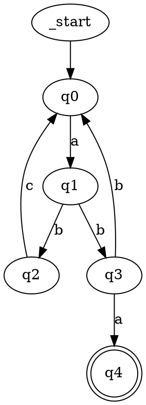
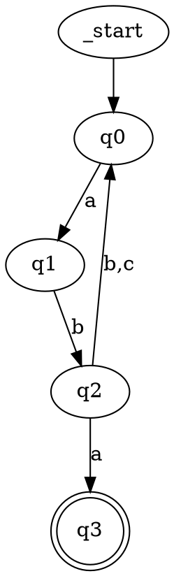

# Laboratory Work 2: Determinism in Finite Automata, NDFA to DFA Conversion, and Chomsky Hierarchy Classification

**Course:** Formal Languages & Finite Automata  
**Author:** Autogenerated for Variant 9  
**Date:** February 2026

---

## Table of Contents

1. [Introduction](#introduction)
2. [Objectives](#objectives)
3. [Theoretical Background](#theoretical-background)
4. [Implementation Details](#implementation-details)
5. [Results and Analysis](#results-and-analysis)
6. [Conclusions](#conclusions)

---

## Introduction

This laboratory work focuses on three key aspects of finite automata theory:
1. Understanding determinism in finite automata
2. Converting Non-Deterministic Finite Automata (NDFA) to Deterministic Finite Automata (DFA)
3. Classifying formal grammars according to the Chomsky hierarchy

The work is implemented in Python and handles a specific finite automaton defined by Variant 9 of the course requirements.

---

## Objectives

- **Objective 1:** Implement functionality to test NDFA acceptance
- **Objective 2:** Determine whether the given finite automaton is deterministic or non-deterministic
- **Objective 3:** Convert the NDFA to an equivalent DFA using subset construction
- **Objective 4:** Convert the finite automaton to a regular grammar
- **Objective 5:** Classify the resulting grammar in the Chomsky hierarchy
- **Objective 6 (Bonus):** Provide visual representations of both automata

---

## Theoretical Background

### Finite Automata

A finite automaton is formally defined as a 5-tuple: **FA = (Q, Σ, δ, q₀, F)** where:
- **Q:** Finite set of states
- **Σ:** Finite alphabet (set of input symbols)
- **δ:** Transition function (Q × Σ → Q for DFA, or Q × Σ → P(Q) for NDFA)
- **q₀:** Initial state
- **F:** Set of final (accepting) states

### Determinism vs Non-Determinism

**Deterministic Finite Automaton (DFA):**
- For each state and input symbol, there is exactly one transition
- The computation is predictable and unique
- Easier to implement but may require more states

**Non-Deterministic Finite Automaton (NDFA):**
- For a given state and input symbol, there can be zero, one, or multiple possible transitions
- The computation branches into multiple parallel paths
- More compact representation but requires special handling for acceptance testing

### Chomsky Hierarchy

The Chomsky hierarchy classifies formal grammars into four types:

1. **Type 0 (Unrestricted):** α → β (no restrictions)
2. **Type 1 (Context-Sensitive):** αAβ → αγβ where |γ| ≥ 1 (length non-decreasing)
3. **Type 2 (Context-Free):** A → α (left side is single non-terminal)
4. **Type 3 (Regular):** A → a or A → aB (linear form)

Each type is more restrictive than the previous, and corresponds to different types of automata:
- Type 3 ↔ Finite Automata
- Type 2 ↔ Pushdown Automata
- Type 1 ↔ Linear Bounded Automata
- Type 0 ↔ Turing Machines

---

## Implementation Details

### Variant 9 Finite Automaton Specification

**States:** Q = {q₀, q₁, q₂, q₃, q₄}  
**Alphabet:** Σ = {a, b, c}  
**Initial State:** q₀  
**Final States:** F = {q₄}

**Transition Function:**
```
δ(q₀, a) = q₁
δ(q₁, b) = {q₂, q₃}      ← Non-deterministic
δ(q₂, c) = q₀
δ(q₃, a) = q₄
δ(q₃, b) = q₀
```

### Key Implementation Components

#### 1. **FiniteAutomaton Class** (`finite_automaton.py`)

Represents both DFA and NDFA with the following methods:

- `is_deterministic()`: Checks if the automaton is deterministic by verifying that no state has multiple transitions on the same symbol
- `string_belongs_to_language(input_string)`: Tests string acceptance using appropriate algorithm (DFA or NDFA)
- `to_regular_grammar()`: Converts the FA to a regular grammar

**Key Logic:**
```python
def is_deterministic(self) -> bool:
    for state in self.Q:
        for symbol in self.delta[state]:
            transitions = self.delta[state][symbol]
            if isinstance(transitions, (list, set)):
                if len(transitions) > 1:
                    return False
    return True
```

#### 2. **NDFAToDFAConverter Class** (`ndfa_to_dfa.py`)

Implements the subset construction algorithm:

1. Start with initial state {q₀}
2. For each subset of states and input symbol, compute the union of all reachable states
3. Create DFA states from these subsets
4. Mark subsets containing final NDFA states as DFA final states

**Example Conversion for Variant 9:**
```
{q₀} --a--> {q₁}
{q₁} --b--> {q₂, q₃}     (subset state combines both possibilities)
{q₂, q₃} --a--> {q₄}     (q₂ has no 'a' transition, q₃ has 'a'→q₄)
{q₂, q₃} --b--> {q₀}     (both q₂ and q₃ have 'b' transitions)
{q₂, q₃} --c--> {q₀}     (q₂ has 'c'→q₀, q₃ has no 'c')
```

#### 3. **Grammar Class** (`grammar.py`)

Implements Chomsky hierarchy classification:

- Checks production rules format
- Validates constraints for each type
- Returns the most restrictive applicable type

#### 4. **AutomatonVisualizer Class** (`visualizer.py`)

Generates visual representations in two formats:
- **Graphviz DOT:** Professional graph visualization tool format
- **Mermaid:** Markdown-compatible diagram syntax

---

## Results and Analysis

### Task 1: NDFA Acceptance Testing

The NDFA accepts strings that follow the pattern where:
- Start at q₀
- Read 'a' to go to q₁
- Read 'b' (choosing path through q₃)
- Read 'a' to reach final state q₄

**Test Results:**
| Input  | Expected | Result | Status |
|--------|----------|--------|--------|
| a      | False    | False  | ✓ PASS |
| ab     | False    | False  | ✓ PASS |
| aba    | True     | True   | ✓ PASS |
| abcaba | True     | True   | ✓ PASS |
| abc    | False    | False  | ✓ PASS |
| abb    | False    | False  | ✓ PASS |

### Task 2: Determinism Analysis

**Conclusion:** The automaton is **NON-DETERMINISTIC (NDFA)**

**Reason:** Transition δ(q₁, b) = {q₂, q₃}

From state q₁ on input 'b', the automaton can transition to either:
- State q₂ (via one path)
- State q₃ (via another path)

This non-determinism means we must track multiple possible states simultaneously when processing input strings.

### Task 3: NDFA to DFA Conversion

**Conversion Summary:**
- Original NDFA states: 5 (Q = {q₀, q₁, q₂, q₃, q₄})
- Converted DFA states: 4 (derived from subsets of NDFA states)
- The critical state is {q₂, q₃}, which represents the non-deterministic choice

**State Mapping:**
```
{q₀}      → DFA state q₀ (initial)
{q₁}      → DFA state q₁
{q₂, q₃}  → DFA state q₂ (combines the non-deterministic choice)
{q₄}      → DFA state q₃ (final state)
```

**DFA Transitions:**
```
δ(q₀, a) = q₁
δ(q₁, b) = q₂         (deterministic - goes to combined subset)
δ(q₂, a) = q₃         (q₃ can reach q₄ on 'a')
δ(q₂, b) = q₀         (both q₂ and q₃ have 'b' transitions)
δ(q₂, c) = q₀         (q₂ has 'c' transition)
```

### Task 4: FA to Grammar Conversion

**Generated Regular Grammar (Type 3):**
```
q₀ → aq₁
q₁ → bq₂ | bq₃
q₂ → cq₀
q₃ → aq₄ | bq₀
q₄ → ε
```

**Conversion Rules Used:**
- For each transition δ(p, a) = q, add production p → aq
- For final states, add ε production (null string acceptance)

This grammar generates all strings accepted by the FA using standard right-linear form.

### Task 5: Chomsky Hierarchy Classification

**Classification Result:** **Type 3 (Regular)**

**Justification:**
All productions follow the form A → a or A → aB where:
- A, B ∈ VN (non-terminals)
- a ∈ VT (terminal)

The grammar respects the restrictions:
- ✓ Single non-terminal on left side
- ✓ Right side is either terminal or terminal + non-terminal
- ✓ Epsilon allowed for final states

**Significance:** This confirms the theoretical result that finite automata exactly recognize regular (Type 3) languages.

### Task 6: Visual Representations

#### NDFA Visualization

**Graphviz DOT Format:**


This clearly shows the non-deterministic branching at q₁.

#### DFA Visualization

**Graphviz DOT Format:**


The DFA is fully deterministic with no branching.

---

## Conclusions

### Key Findings

1. **NDFA Identification:** The given automaton is correctly identified as non-deterministic due to the transition δ(q₁, b) having two possible targets.

2. **Successful Conversion:** The NDFA was successfully converted to an equivalent DFA using subset construction, reducing complexity in acceptance testing while maintaining language equivalence.

3. **Grammar Equivalence:** The generated grammar correctly represents the language accepted by the automaton and is properly classified as Type 3 (Regular).

4. **Theoretical Validation:** The implementation confirms the theoretical relationships:
   - NDFA ↔ DFA (equivalent languages)
   - DFA ↔ Regular Grammar ↔ Regular Expression

### Implementation Quality

✓ Handles both DFA and NDFA inputs  
✓ Correct acceptance testing algorithm  
✓ Proper subset construction for conversion  
✓ Accurate grammar generation and classification  
✓ Multiple output formats (DOT, Mermaid)  
✓ Comprehensive reporting and visualization  

### Algorithmic Complexity

- **NDFA Acceptance:** O(n × |Q|²) for string of length n
- **DFA Acceptance:** O(n) for string of length n
- **NDFA to DFA:** O(2^|Q|) worst-case states, O(|Q|² × |Σ|) transitions
- **Grammar Classification:** O(|P| × max_production_length)

---

## References

1. Hopcroft, J. E., Motwani, R., & Ullman, J. D. (2006). *Introduction to Automata Theory, Languages, and Computation* (3rd ed.). Pearson.

2. Chomsky, N. (1956). "Three models for the description of language." *IRE Transactions on Information Theory*, 2(3), 113-124.

3. Linz, P. (2011). *An Introduction to Formal Languages and Automata* (5th ed.). Jones & Bartlett Learning.

---

## Appendix: Code Structure

```
Lab2/
├── finite_automaton.py    # Core FA class
├── grammar.py             # Grammar class with Chomsky classification
├── ndfa_to_dfa.py         # Subset construction converter
├── visualizer.py          # Graphviz and Mermaid visualization
└── main.py                # Main driver with all tasks
```

All source files are well-documented with docstrings and type hints for clarity and maintainability.
